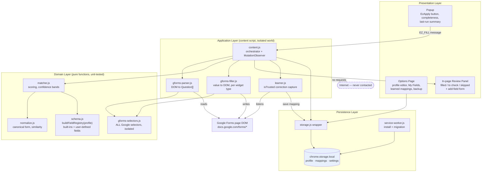
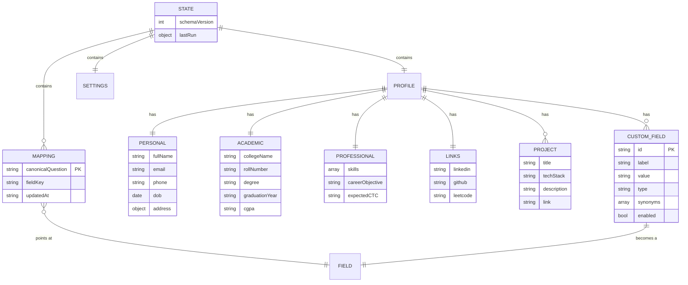
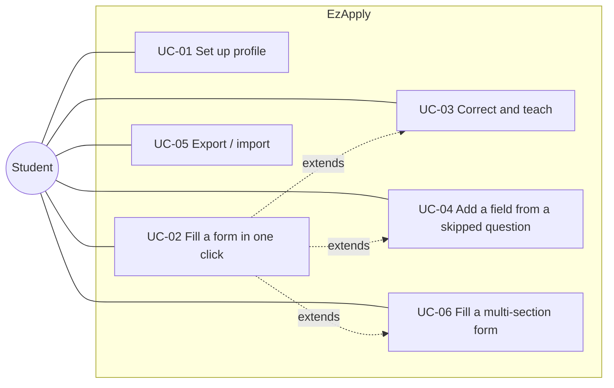
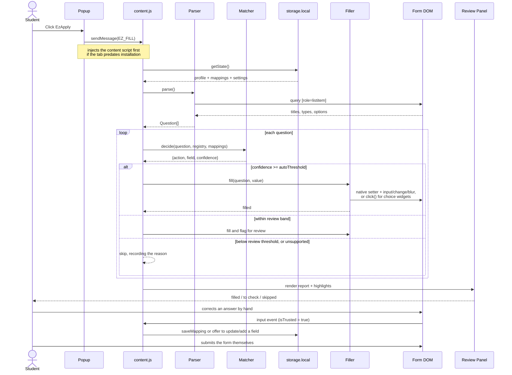
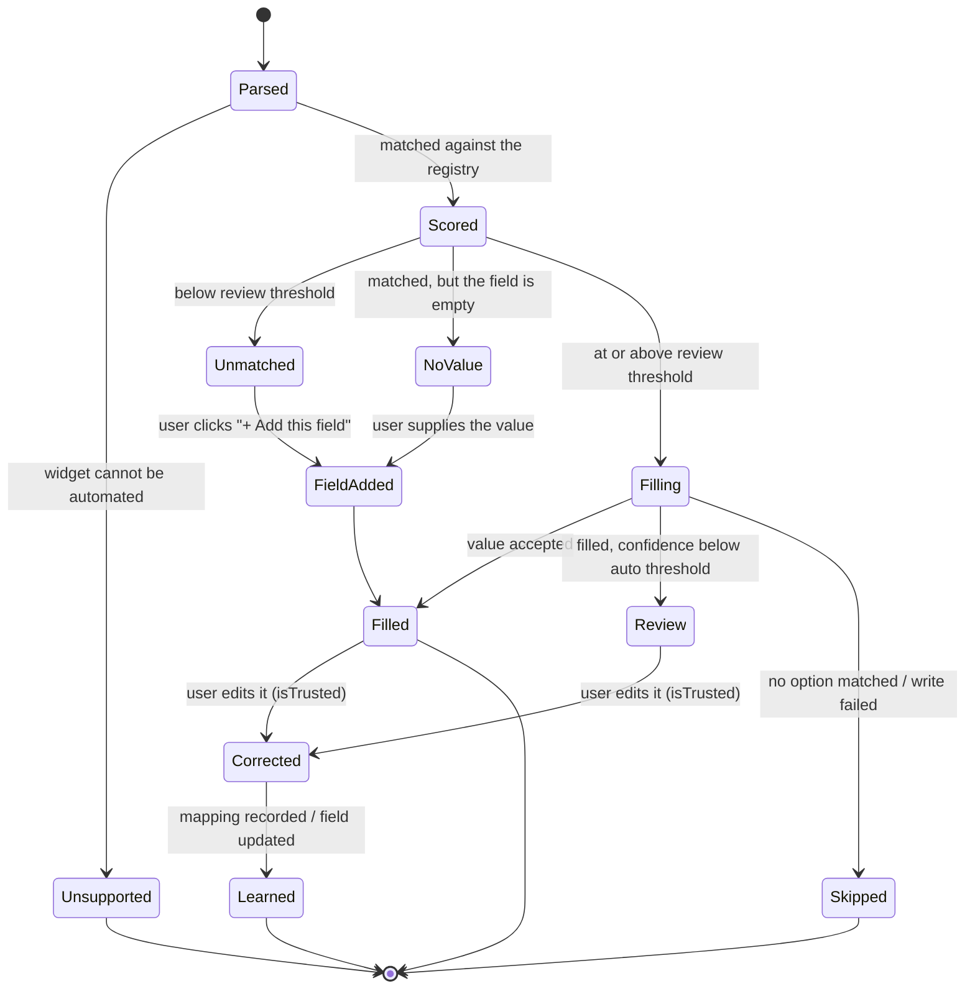

# Software Requirements Specification

## EzApply — One-Click Google Form Filler (Chrome Extension)

| | |
| --- | --- |
| **Document version** | 1.0 |
| **Date** | 4 August 2026 |
| **Prepared for** | Academic project submission |
| **Standard followed** | IEEE Std 830-1998, *Recommended Practice for Software Requirements Specifications* |
| **Software version** | EzApply 1.0.0 |

---

## Table of Contents

1. [Introduction](#1-introduction)
2. [Overall Description](#2-overall-description)
3. [Specific Requirements](#3-specific-requirements)
4. [Data Model and Data Dictionary](#4-data-model-and-data-dictionary)
5. [Use Cases](#5-use-cases)
6. [Test Cases](#6-test-cases)
7. [Requirements Traceability Matrix](#7-requirements-traceability-matrix)
8. [Future Scope](#8-future-scope)
9. [Appendices](#9-appendices)

---

# 1. Introduction

## 1.1 Purpose

This document specifies the functional and non-functional requirements for **EzApply**, a
Google Chrome browser extension that automatically fills repetitive Google Forms from a
locally stored user profile.

It is intended for the developers implementing and maintaining the system, evaluators
assessing the project, and testers validating that the delivered software meets its stated
requirements.

## 1.2 Scope

**The problem.** College placement and internship drives collect applicant information almost
exclusively through Google Forms. A student applying to fifteen companies in a placement season
re-enters the same twenty-five facts fifteen times: full name, mobile number, email, roll
number, degree, branch, graduation year, CGPA, tenth and twelfth percentages, backlog count,
skills, project descriptions, and profile links. The work is tedious, and — more seriously —
error-prone: one mistyped roll number or a stale CGPA can silently disqualify an application.

**The product.** EzApply stores this information once in the browser's local storage. On any
Google Form, a single click reads every question on the page, matches each question against
the stored profile, and writes the answers directly into the form's controls. A review panel
then reports what was filled, what needs checking, and what was skipped and why.

**In scope for version 1.0**

- Google Forms only (`https://docs.google.com/forms/*`)
- A single user profile
- Short answer, paragraph, multiple choice, checkbox, dropdown, linear scale, date and time
  question types
- User-defined fields, matched and filled identically to built-in fields
- Learning from user corrections
- Local JSON export and import

**Explicitly out of scope for version 1.0**

- Submitting the form. EzApply fills and stops; the user always reviews and submits.
- File and resume uploads. Google's file question opens a Drive picker that browser
  extensions cannot operate.
- Grid (matrix) questions.
- Non-Google forms.
- Any server, account, cloud sync, analytics, or network communication whatsoever.

**Benefits.** A form that takes six to eight minutes by hand is completed in seconds; the
transcription errors that come from repetitive manual entry are eliminated; and because the
data never leaves the device, no third party ever holds the student's personal information.

## 1.3 Definitions, Acronyms and Abbreviations

| Term | Meaning |
| --- | --- |
| **MV3** | Manifest V3, the current Chrome extension platform |
| **Content script** | Extension JavaScript injected into a web page, running in an *isolated world* — it shares the page's DOM but has a separate JavaScript environment |
| **Service worker** | The MV3 background script; event-driven and terminated when idle |
| **ARIA role** | An accessibility attribute (`role="radio"`, `role="listitem"`) describing an element's semantic purpose |
| **Closure** | The Google JavaScript framework Google Forms is built on |
| **Question** | One `role="listitem"` block on a Google Form: a title, optional help text, and one answer widget |
| **Field** | One addressable item of stored user data, e.g. `personal.phone` |
| **Field registry** | The list of all fields EzApply can match against — built-ins plus the user's own |
| **Custom / user-defined field** | A field the user created themselves, e.g. "LeetCode Profile Link" |
| **Synonym** | An alternative phrasing that should match a field, e.g. "contact number" for `personal.phone` |
| **Canonical form** | A question label reduced to lowercase, stopword-free, stemmed tokens; the single space in which all text comparison happens |
| **Confidence** | A 0–1 score expressing how well a question matches a field |
| **Learned mapping** | A user-taught question → field association |
| **`isTrusted`** | A browser-set flag, `true` only for events generated by real user input |
| **Dice coefficient** | A set-overlap similarity measure, `2·|A∩B| / (|A|+|B|)` |
| **Levenshtein distance** | The minimum number of single-character edits transforming one string into another |
| **SRS** | Software Requirements Specification |

## 1.4 References

1. IEEE Std 830-1998, *IEEE Recommended Practice for Software Requirements Specifications*.
2. Chrome Extensions — Manifest V3 documentation, Google, `developer.chrome.com/docs/extensions`.
3. WAI-ARIA 1.2, W3C Recommendation.
4. `EzApply/README.md` — installation, usage and maintenance guide.
5. `EzApply/src/content/gforms-selectors.js` — the authoritative record of the Google Forms
   DOM contract this system depends on.

## 1.5 Overview

Section 2 describes the product in general terms — its context, its principal functions, its
users, and the constraints it operates under. Section 3 states the detailed requirements
against which the software is to be built and verified. Sections 4 to 7 give the data model,
use cases, test cases and traceability. Section 8 records deferred work.

---

# 2. Overall Description

## 2.1 Product Perspective

EzApply is a self-contained Chrome extension. It has no server component, no database beyond
the browser's own storage, and no dependency on any external library or service. It is a new
product, not a replacement for or component of any existing system.

It interfaces with exactly three things: the Chrome Extensions API, the browser's local
storage, and the DOM of a Google Forms page.

### 2.1.1 System Architecture

The system is organised into four layers. The strict separation is deliberate: the domain
layer contains no DOM and no `chrome.*` calls, which is what makes it testable outside a
browser; and all knowledge of Google's markup is confined to a single file, so a change on
Google's side has exactly one place to be fixed.



## 2.2 Product Functions

| # | Function | Summary |
| --- | --- | --- |
| F1 | Profile management | Enter and edit personal, academic, professional, project and link data |
| F2 | User-defined fields | Create fields the built-in set does not cover; they then behave exactly like built-ins |
| F3 | Form parsing | Read every question on a Google Form: title, help text, required flag, widget type, options |
| F4 | Question matching | Score each question against the field registry and assign a confidence band |
| F5 | Form filling | Write values using the correct DOM technique for each widget type |
| F6 | Review reporting | Show what was filled, what to check, and what was skipped with reasons |
| F7 | Learning | Capture user corrections and improve future accuracy |
| F8 | Settings | Tune the confidence threshold and toggle behaviours |
| F9 | Backup | Export and import the whole profile as JSON |

## 2.3 User Characteristics

The primary user is an undergraduate student in a placement or internship season. They are
comfortable using a browser and installing an extension when given step-by-step instructions,
but are not assumed to have any programming knowledge. They will not read documentation before
first use, so the interface must be self-explanatory and the first-run experience must lead
them to the options page unprompted.

A secondary user is a job applicant using Google Forms for applications generally; the
requirements are identical.

## 2.4 General Constraints

| # | Constraint | Consequence for the design |
| --- | --- | --- |
| C1 | **Google Forms uses no native form controls.** Radio buttons are `div[role="radio"]`, checkboxes `div[role="checkbox"]`, dropdowns `div[role="listbox"]`. Only short answer and paragraph are real `<input>`/`<textarea>` elements. | Filling requires a separate strategy per widget type; choice widgets must be driven with `click()`. |
| C2 | **Google Forms reads its own internal model at submit time, not `input.value`.** | A plain `element.value = x` appears correct on screen but submits an empty answer. All text writes must go through the native prototype value setter followed by bubbling `input` and `change` events and a real blur. |
| C3 | **Google's CSS class names are obfuscated and rotate without notice.** | Selectors must be ARIA-role- and attribute-first, and confined to one file. |
| C4 | **Dropdown options are rendered lazily**, only after the listbox is opened. | The filler must open the listbox and poll for options before matching. |
| C5 | **MV3 content scripts cannot use ES modules.** | Shared code uses a single global namespace object and manifest-declared load order. |
| C6 | **`chrome.storage.sync` caps items at 8 KB.** | Local storage must be used; export/import is the backup mechanism. |
| C7 | **File upload questions open a Google Drive picker.** | Cannot be automated at all; must be reported honestly as skipped. |
| C8 | **Multi-section forms replace questions without navigating.** | A `MutationObserver` is required to notice a new section. |

## 2.5 Assumptions and Dependencies

- The user runs Google Chrome (or another Chromium browser) version 88 or later, which is the
  minimum for Manifest V3.
- The user has Developer Mode enabled to load the unpacked extension.
- Google Forms continues to expose questions through standard ARIA roles. This is the single
  external dependency the system cannot control; §2.4/C3 describes the mitigation, and the
  risk is accepted rather than eliminated.
- Form questions are written in English. Non-English labels will parse but will not match.

## 2.6 Apportioning of Requirements

Requirements deferred beyond version 1.0 are recorded in [§8 Future Scope](#8-future-scope).

---

# 3. Specific Requirements

## 3.1 External Interface Requirements

### 3.1.1 User Interfaces

**UI-1 — Toolbar popup.** 320 px wide. Shows a profile-completeness bar, a primary **EzApply**
button, the previous run's result, and a link to the options page. The button is disabled with
an explanatory caption when the current tab is not a Google Form, or when the profile is empty.

**UI-2 — Options page.** A full-width page with a sticky section navigation. Sections: Personal,
Academic, Professional, Links, Projects, My Fields, Learned, Settings, Backup. All edits
autosave, with a visible "Saved" confirmation.

**UI-3 — In-page review panel.** A fixed panel at the bottom-right of the form, collapsible and
dismissible, listing results in three groups (**Check these**, **Filled**, **Skipped**).
Clicking a row scrolls to and highlights that question. Unmatched rows carry an
**+ Add this field** button.

**UI-4 — Question highlighting.** Filled questions receive a green outline, uncertain ones an
amber outline, skipped ones a dashed grey outline.

**UI-5 — Accessibility.** All colour-coded information is duplicated in text; the panel carries
`role="complementary"` with an accessible label; both light and dark colour schemes are
supported.

### 3.1.2 Hardware Interfaces

None. EzApply requires no hardware beyond that needed to run Chrome.

### 3.1.3 Software Interfaces

| Interface | Purpose |
| --- | --- |
| `chrome.storage.local` | Sole persistence mechanism |
| `chrome.tabs` / `chrome.runtime` | Message passing between popup and content script |
| `chrome.scripting` | On-demand content-script injection for tabs open before install |
| `chrome.action`, `chrome.runtime.openOptionsPage` | Toolbar button and options page |
| Google Forms DOM | Read via ARIA roles; written via DOM APIs and synthetic events |

### 3.1.4 Communications Interfaces

**None.** EzApply performs no network communication of any kind. This is a requirement, not an
implementation detail: see NFR-6.

## 3.2 Functional Requirements

Priority: **M** = mandatory, **D** = desirable.

### 3.2.1 Profile Management

| ID | Requirement | Pri. | Acceptance criteria |
| --- | --- | --- | --- |
| FR-01 | The system shall let the user enter and edit personal, academic, professional, project and link data through the options page. | M | Every field in §4.1 is editable and its value persists across a browser restart. |
| FR-02 | The system shall autosave every edit without an explicit save action. | M | A change is persisted within 1 second of the last keystroke and a "Saved" indicator appears. |
| FR-03 | The system shall support an arbitrary number of project entries, each with title, tech stack, link, duration and description. | M | Projects can be added and removed; the list survives a reload. |
| FR-04 | The system shall accept multi-valued fields (skills, preferred locations) as a managed list. | M | Values can be added by typing or pasting a comma-separated list, and removed individually. |
| FR-05 | The system shall display the proportion of fields the user has filled in. | D | The popup shows "*n* of *m* fields set" and a proportional bar. |

### 3.2.2 User-Defined Fields

| ID | Requirement | Pri. | Acceptance criteria |
| --- | --- | --- | --- |
| FR-06 | The system shall let the user define fields not present in the built-in set, specifying a name, a value and a type. | M | A field created in **My Fields** is stored and appears in the registry. |
| FR-07 | User-defined fields shall participate in question matching on exactly the same terms as built-in fields. | M | A form question matching a user-defined field is filled from it without further configuration. |
| FR-08 | The system shall derive matching phrases automatically from a user-defined field's name. | M | A field named "LeetCode Profile Link" fills a question titled "Your LeetCode profile". |
| FR-09 | The system shall let the user supply additional matching phrases for a user-defined field. | D | Phrases entered under "Also matches" are used in scoring. |
| FR-10 | The system shall let the user disable a user-defined field without deleting it. | D | A disabled field is excluded from the registry but retained in storage. |
| FR-11 | The system shall warn when a proposed user-defined field overlaps an existing field. | D | Adding "Phone Number" warns that it overlaps the built-in Mobile Number field. |
| FR-12 | The system shall let the user create a user-defined field directly from an unmatched question in the review panel, pre-filling the field name from the question title and inferring its type from the widget. | M | Clicking **+ Add this field** opens a form pre-filled as described; saving stores the field and fills the question immediately. |
| FR-13 | Deleting a user-defined field shall also delete any learned mappings pointing at it. | M | No mapping referencing a deleted field remains in storage. |

### 3.2.3 Storage and Backup

| ID | Requirement | Pri. | Acceptance criteria |
| --- | --- | --- | --- |
| FR-14 | The system shall persist all data in `chrome.storage.local`. | M | Data survives browser restart and is confined to the local profile. |
| FR-15 | The system shall migrate stored data forward when the schema changes, without data loss. | M | A profile saved under an older schema retains all its values and gains new fields at their defaults. |
| FR-16 | The system shall export the complete profile, custom fields, mappings and settings as a JSON file. | M | The exported file re-imports to an identical state. |
| FR-17 | The system shall import a previously exported JSON file, replacing current data. | M | Import validates the file and reports a clear error if it is not an EzApply backup. |
| FR-18 | The system shall allow the user to erase all stored data, after an explicit confirmation. | D | A confirmation dialog is shown; on confirm, storage returns to defaults. |

### 3.2.4 Form Parsing

| ID | Requirement | Pri. | Acceptance criteria |
| --- | --- | --- | --- |
| FR-19 | The system shall identify every question on the current form section. | M | All `role="listitem"` question blocks are found; nested option items are not double-counted. |
| FR-20 | The system shall extract each question's title, with the required-question asterisk removed. | M | "Full Name *" yields the title "Full Name". |
| FR-21 | The system shall extract each question's help text where present, for use as a secondary matching signal. | D | Help text is captured and does not contaminate the title. |
| FR-22 | The system shall record whether each question is required. | D | Required questions are flagged correctly. |
| FR-23 | The system shall classify each question as short answer, paragraph, radio, checkbox, dropdown, linear scale, date, time, or unsupported. | M | Each widget type in the reference form is classified correctly. |
| FR-24 | The system shall extract the available options and their values for every choice question. | M | Option labels are read from `data-value`, `data-answer-value` or `aria-label`, in that order. |
| FR-25 | The system shall classify questions it cannot fill as unsupported **with a stated reason**, rather than ignoring them. | M | A file-upload question is reported as skipped with an explanation. |
| FR-26 | Non-question blocks (section headings, images, descriptive text) shall be excluded from results. | M | They do not appear in the review panel. |

### 3.2.5 Question Matching

| ID | Requirement | Pri. | Acceptance criteria |
| --- | --- | --- | --- |
| FR-27 | The system shall reduce every question title and every field phrase to a common canonical form before comparison. | M | "Your Mobile Number *" and "mobile number" produce identical canonical forms. |
| FR-28 | The canonical form shall expand the abbreviations commonly used on Indian college forms. | M | "Roll No.", "Mob No", "DOB", "12th %" resolve to their long forms. |
| FR-29 | The canonical form shall normalise plurals and possessives. | D | "Skills"/"Skill" and "Father's Name"/"Father Name" compare equal. |
| FR-30 | The system shall resolve a match in priority order: learned mapping (1.00), exact synonym (0.95), contained phrase (0.72–0.97 by coverage), token overlap. | M | Each tier is reachable and outranks those below it. |
| FR-31 | The system shall assign each question a confidence band: **fill** at or above the auto threshold, **review** down to the review threshold, **unmatched** below. | M | Bands are applied per the configured thresholds. |
| FR-32 | The system shall not write a value into a question of an incompatible type. | M | An email field does not fill a date question. |
| FR-33 | Where a matched field holds no value, the system shall report that rather than substituting a different field. | M | With `fatherName` empty, "Father's Name" is reported as unfilled and is **not** answered with the user's own name. |
| FR-34 | Where the best match is empty and a genuinely close alternative holds a value, the system may prefer the alternative. | D | The alternative is used only within a 0.08 confidence margin. |

### 3.2.6 Form Filling

| ID | Requirement | Pri. | Acceptance criteria |
| --- | --- | --- | --- |
| FR-35 | The system shall fill all matched questions on the current section from a single user action. | M | One click on **EzApply** fills the section. |
| FR-36 | Text values shall be written such that the value is registered by Google Forms' own model. | M | **A submitted response contains the filled values** — verification by inspecting the page is insufficient. |
| FR-37 | The system shall select the choice option best matching the stored value, tolerating decoration and punctuation differences. | M | A stored "B.Tech" selects an option labelled "B.Tech / B.E.". |
| FR-38 | For checkbox questions the system shall select every option covered by a multi-valued stored field. | M | Skills "Java, Python, React, SQL" tick Java, Python and React where those are the options offered. |
| FR-39 | The system shall open a dropdown and wait for its options to render before matching. | M | A dropdown whose options render only on click is filled correctly. |
| FR-40 | Where no option matches and an "Other" choice with a free-text box exists, the system shall use it. | D | The Other option is selected and the value typed into its box. |
| FR-41 | Date values shall be written in the format the question expects, for both single and split day/month/year inputs. | M | A stored ISO date fills both layouts. |
| FR-42 | A failure on one question shall never prevent the remaining questions from being filled. | M | An induced error on one question still yields a complete run. |
| FR-43 | The system shall never submit the form. | M | No code path activates a submit control. |

### 3.2.7 Review Panel

| ID | Requirement | Pri. | Acceptance criteria |
| --- | --- | --- | --- |
| FR-44 | After a run the system shall display the outcome grouped as filled, to check, and skipped. | M | Counts match the questions on the page. |
| FR-45 | Every skipped question shall be listed **with the reason it was skipped**. | M | No question is silently omitted. |
| FR-46 | The system shall highlight each question on the page according to its outcome. | D | Green, amber and dashed-grey outlines are applied. |
| FR-47 | Selecting a panel row shall scroll to and momentarily highlight that question. | D | The question is brought into view. |
| FR-48 | The panel shall state that the form has not been submitted. | M | The message is visible without scrolling. |
| FR-49 | The panel shall render all page-derived text as text, never as markup. | M | A question title containing HTML is displayed literally and no script executes. |

### 3.2.8 Learning from Corrections

| ID | Requirement | Pri. | Acceptance criteria |
| --- | --- | --- | --- |
| FR-50 | The system shall distinguish edits made by the user from values it wrote itself, using the browser's `isTrusted` event flag. | M | A script-dispatched change is ignored; a real edit is acted on. |
| FR-51 | Where a corrected value already exists in the profile, the system shall record a learned mapping from that question to that field. | M | Typing the alternate email into "Email ID" records `email id → personal.altEmail`. |
| FR-52 | A learned mapping shall apply to any later question with the same canonical title, on any form. | M | The mapping applies on a different form using different wording. |
| FR-53 | Where a corrected value is new but the question was already understood, the system shall offer to **update** the existing field, not create a duplicate. | M | Changing a phone number offers "Update Mobile Number" and leaves the custom-field count unchanged. |
| FR-54 | Where a corrected value is new and the question was unrecognised, the system shall offer to save it as a user-defined field. | M | The add-field form opens pre-filled with the typed value. |
| FR-55 | All learned mappings shall be visible to the user and individually deletable. | M | The options page lists every mapping with a "Forget" control. |
| FR-56 | Learning shall be disableable. | D | With the setting off, no mapping is recorded. |

### 3.2.9 Settings and Multi-Section Forms

| ID | Requirement | Pri. | Acceptance criteria |
| --- | --- | --- | --- |
| FR-57 | The user shall be able to adjust the confidence threshold at which questions are filled without flagging. | D | Moving the slider changes the fill/review split on a subsequent run. |
| FR-58 | The user shall be able to toggle learning, highlighting, and the review panel. | D | Each toggle takes effect on the next run. |
| FR-59 | The system shall detect a new section on a multi-page form and offer to fill it. | M | After "Next", the user is notified or (if enabled) the section is filled automatically. |
| FR-60 | The system shall function on a tab that was already open when the extension was installed. | M | The content script is injected on demand; no reload is required. |

## 3.3 Performance Requirements

| ID | Requirement | Target |
| --- | --- | --- |
| PR-1 | Parse and fill a 30-question form | ≤ 3 seconds |
| PR-2 | Parse phase alone | ≤ 300 ms for 50 questions |
| PR-3 | Popup ready to interact | ≤ 300 ms |
| PR-4 | Options page first render | ≤ 500 ms |
| PR-5 | Autosave latency after last keystroke | ≤ 1 second |
| PR-6 | Storage footprint for a fully populated profile | ≤ 200 KB (limit: 10 MB) |
| PR-7 | Concurrent users | 1 (single-user, single-device by design) |

## 3.4 Design Constraints

Restated from §2.4 as binding constraints on implementation:

- **DC-1** Manifest V3 only; no ES modules in content scripts.
- **DC-2** No build step, transpiler, bundler or runtime dependency. The source in the
  repository is what runs.
- **DC-3** All Google Forms selectors confined to `src/content/gforms-selectors.js`.
- **DC-4** ARIA roles and semantic attributes preferred over CSS classes in all selectors.
- **DC-5** The domain layer (`normalize.js`, `matcher.js`, `schema.js`) must contain no DOM
  or `chrome.*` access, so that it remains unit-testable under Node.
- **DC-6** Host permission limited to `https://docs.google.com/forms/*`.

## 3.5 Software System Attributes

### 3.5.1 Reliability

| ID | Requirement |
| --- | --- |
| NFR-1 | A failure on any one question shall be caught and reported, and shall not abort the run (FR-42). |
| NFR-2 | An unreadable or unrecognised question shall be reported as skipped with a reason, never silently ignored (FR-45). |
| NFR-3 | A malformed or corrupt stored state shall be repaired to defaults on read rather than crashing the extension. |

### 3.5.2 Availability

| ID | Requirement |
| --- | --- |
| NFR-4 | The system shall operate entirely offline once installed. |
| NFR-5 | No component shall depend on the availability of any external service. |

### 3.5.3 Security and Privacy

| ID | Requirement |
| --- | --- |
| NFR-6 | The system shall make **no network requests of any kind.** No telemetry, no analytics, no error reporting, no remote configuration. |
| NFR-7 | All user data shall remain in `chrome.storage.local`, within the user's own browser profile. |
| NFR-8 | Host permissions shall be limited to `https://docs.google.com/forms/*`; the extension shall have no access to any other site. |
| NFR-9 | Permissions shall be limited to `storage`, `activeTab` and `scripting`. |
| NFR-10 | Text originating from a form page shall be treated as untrusted and inserted only as text, never as markup (FR-49). A Google Form is authored by a third party. |
| NFR-11 | The system shall not read, store or transmit form responses other than the values it writes. |

### 3.5.4 Maintainability

| ID | Requirement |
| --- | --- |
| NFR-12 | All knowledge of Google's markup shall be confined to one file, so a change on Google's side has a single point of repair (DC-3). |
| NFR-13 | The domain layer shall be covered by automated tests runnable without a browser. |
| NFR-14 | The options-page profile editor shall be generated from the field registry, so the editable fields and the matchable fields cannot diverge. |
| NFR-15 | Each module shall have a single responsibility: parsing shall not fill, filling shall not query selectors directly, matching shall not touch the DOM. |

### 3.5.5 Portability

| ID | Requirement |
| --- | --- |
| NFR-16 | The system shall run on any Chromium-based browser supporting Manifest V3 (Chrome, Edge, Brave, Opera) without modification. |
| NFR-17 | The system shall not depend on the host operating system. |

### 3.5.6 Usability

| ID | Requirement |
| --- | --- |
| NFR-18 | A first-time user shall reach the data-entry screen without instruction: the options page opens automatically on install. |
| NFR-19 | Every skipped question shall carry a reason a non-technical user can act on. |
| NFR-20 | No colour-coded information shall be conveyed by colour alone. |
| NFR-21 | Both light and dark browser colour schemes shall be supported. |

---

# 4. Data Model and Data Dictionary

## 4.1 Entity Relationship



## 4.2 Data Dictionary

### 4.2.1 Personal

| Field | Type | Constraint | Example |
| --- | --- | --- | --- |
| `personal.fullName` | text | — | Yash Daoev |
| `personal.firstName` / `lastName` | text | — | Yash / Daoev |
| `personal.gender` | choice | — | Male |
| `personal.dob` | date | ISO `yyyy-mm-dd` | 2003-05-14 |
| `personal.email` | email | valid address | yash@example.com |
| `personal.altEmail` | email | valid address | yash.college@univ.edu |
| `personal.phone` | tel | digits, optional `+` | +919876543210 |
| `personal.altPhone` | tel | digits, optional `+` | +919812345678 |
| `personal.fatherName` / `motherName` | text | — | — |
| `personal.bloodGroup` | choice | — | O+ |
| `personal.nationality` | text | — | Indian |
| `personal.address.line1` | longtext | — | 12 MG Road |
| `personal.address.city` / `state` / `country` | text | — | Pune / Maharashtra / India |
| `personal.address.pincode` | number | 6 digits (IN) | 411001 |

### 4.2.2 Academic

| Field | Type | Constraint | Example |
| --- | --- | --- | --- |
| `academic.collegeName` | text | — | ABC Institute of Technology |
| `academic.rollNumber` | text | alphanumeric | 21CS1234 |
| `academic.registrationNumber` | text | alphanumeric | 2021ABC0456 |
| `academic.degree` | choice | — | B.Tech |
| `academic.branch` | choice | — | Computer Science |
| `academic.specialization` | text | — | AI & ML |
| `academic.admissionYear` | number | 4-digit year | 2022 |
| `academic.graduationYear` | number | 4-digit year | 2026 |
| `academic.currentSemester` | number | 1–10 | 7 |
| `academic.cgpa` | number | 0–10, decimals allowed | 8.6 |
| `academic.degreePercentage` | number | 0–100 | 81.5 |
| `academic.tenthPercent` / `twelfthPercent` | number | 0–100 | 92 / 88 |
| `academic.tenthBoard` / `twelfthBoard` | text | — | CBSE |
| `academic.tenthYear` / `twelfthYear` | number | 4-digit year | 2020 / 2022 |
| `academic.activeBacklogs` | number | ≥ 0 | 0 |
| `academic.totalBacklogs` | number | ≥ 0 | 1 |
| `academic.yearGap` | text | — | No |

### 4.2.3 Professional, Projects and Links

| Field | Type | Constraint | Example |
| --- | --- | --- | --- |
| `professional.skills` | list | comma-joined when filled | Java, Python, React, SQL |
| `professional.experienceYears` | number | ≥ 0 | 0 |
| `professional.internships` | longtext | — | — |
| `professional.certifications` | longtext | — | — |
| `professional.achievements` | longtext | — | — |
| `professional.careerObjective` | longtext | — | — |
| `professional.currentCTC` / `expectedCTC` | text | — | 8 LPA |
| `professional.noticePeriod` | text | — | Immediate |
| `professional.preferredLocations` | list | — | Pune, Bengaluru |
| `projects[]` | array | derived into a formatted block | see §4.3 |
| `links.linkedin` / `github` / `portfolio` / `resumeUrl` / `leetcode` / `hackerrank` / `codechef` | link | `https://` added if absent | github.com/yash |

### 4.2.4 Custom Field

| Attribute | Type | Description |
| --- | --- | --- |
| `id` | string | Generated from the label plus a timestamp; stable for the life of the field |
| `label` | string | The field's name; also the source of its automatic synonyms |
| `value` | string | The answer to fill |
| `type` | enum | `text`, `longtext`, `number`, `email`, `tel`, `date`, `link`, `choice` |
| `synonyms` | array | Extra matching phrases supplied by the user |
| `enabled` | boolean | When false, excluded from the registry but retained |
| `createdAt` | ISO timestamp | — |

### 4.2.5 Learned Mapping

| Attribute | Type | Description |
| --- | --- | --- |
| *key* | string | The question title in canonical form |
| `fieldKey` | string | The field it resolves to, e.g. `personal.altEmail` |
| `label` | string | The original question text, for display |
| `updatedAt` | ISO timestamp | — |

### 4.2.6 Settings

| Setting | Type | Default | Effect |
| --- | --- | --- | --- |
| `autoThreshold` | number | 0.80 | At or above this confidence, fill without flagging |
| `reviewThreshold` | number | 0.55 | Below this, do not fill at all |
| `learnFromCorrections` | boolean | true | Enables §3.2.8 |
| `highlightFilled` | boolean | true | Outlines questions on the page |
| `showPanel` | boolean | true | Shows the review panel |
| `autoFillNewSections` | boolean | false | Fills a new section without a further click |

## 4.3 Derived Values

`projects[]` is not filled directly. When a question matches the Projects field, the array is
rendered into a numbered block:

```
1. EzApply
   Tech: JavaScript, Chrome MV3
   One-click Google Form filler.
   https://github.com/x/ezapply
```

---

# 5. Use Cases



## UC-01 — Set up the profile

| | |
| --- | --- |
| **Actor** | Student |
| **Precondition** | Extension installed |
| **Postcondition** | Profile stored locally |

**Main flow**

1. The options page opens automatically after installation.
2. The student fills in personal, academic, professional, project and link details.
3. Each change autosaves; a "Saved" indicator confirms.
4. The popup's completeness bar reflects the new state.

**Alternate flow — 2a.** The student adds fields the built-in set does not cover under
**My Fields**, supplying a name, value and type.

## UC-02 — Fill a form in one click

| | |
| --- | --- |
| **Actor** | Student |
| **Precondition** | A Google Form is open; the profile has data |
| **Postcondition** | The form is filled but **not** submitted |

**Main flow**

1. The student opens a placement Google Form.
2. They click the EzApply toolbar icon, then the **EzApply** button.
3. The system parses every question, matches each against the registry, and fills what it can.
4. The review panel opens showing filled, to-check and skipped counts; questions are outlined
   on the page.
5. The student reviews, then submits the form themselves.

**Alternate flows**

- **2a.** The tab predates installation, so no content script is present: the system injects it
  on demand and continues.
- **3a.** A question type cannot be filled (file upload, grid): it is listed as skipped with the
  reason.
- **3b.** A matched field is empty: the question is listed as unfilled, naming the field to
  complete.

## UC-03 — Correct an answer and teach the system

| | |
| --- | --- |
| **Actor** | Student |
| **Precondition** | A run has completed; learning is enabled |
| **Postcondition** | Future forms answer this question correctly |

**Main flow**

1. The student notices a wrong answer and types the correct one directly in the form.
2. The system detects a genuine user edit via the `isTrusted` flag.
3. It searches the profile for a field already holding that value.
4. On a hit, it records the question → field mapping and confirms with a toast.

**Alternate flows**

- **3a.** The value is new but the question was understood → the system offers to **update**
  that field. Choosing update changes the stored value; no duplicate field is created.
- **3b.** The value is new and the question was unrecognised → the system offers to save it as
  a user-defined field (continues as UC-04 from step 3).

## UC-04 — Add a user-defined field from a skipped question

| | |
| --- | --- |
| **Actor** | Student |
| **Precondition** | A run has completed with at least one unmatched question |
| **Postcondition** | A new field exists and answers that question on all future forms |

**Main flow**

1. The student sees the unmatched question — say "LeetCode profile link" — in the panel's
   *Skipped* list.
2. They click **+ Add this field**.
3. A form opens with the field name taken from the question title, the type inferred from the
   widget, and the automatic matching phrases shown.
4. They enter the value and save.
5. The field is stored, the question is filled immediately, and its highlight turns green.
6. A later form asking "Your LeetCode profile" is filled without further action.

**Alternate flow — 3a.** The name overlaps an existing field; a warning suggests filling that
field instead.

## UC-05 — Export and import

| | |
| --- | --- |
| **Actor** | Student |
| **Precondition** | Profile has data |
| **Postcondition** | A JSON backup exists, or a backup has been restored |

**Main flow**

1. Options page → **Backup** → **Export JSON** downloads a dated file.
2. On another machine, **Import JSON** selects that file.
3. The profile, custom fields, mappings and settings are restored.

**Alternate flow — 2a.** The file is not an EzApply backup; import is rejected with a clear
message and existing data is untouched.

## UC-06 — Fill a multi-section form

| | |
| --- | --- |
| **Actor** | Student |
| **Precondition** | A form with sections is open |
| **Postcondition** | Every section is filled |

**Main flow**

1. The student fills section one (UC-02) and clicks Google's **Next**.
2. The system detects the new questions.
3. It notifies the student, or fills automatically if that setting is enabled.
4. Repeated until the final section, which the student submits.

## 5.1 Sequence — one click



## 5.2 State — a question during a run



---

# 6. Test Cases

| ID | Requirement | Test | Expected result | Status |
| --- | --- | --- | --- | --- |
| TC-01 | FR-27, FR-28 | Normalize "Roll No.", "Mob No", "DOB", "12th %" | Expanded to canonical long forms | Pass |
| TC-02 | FR-28 | Normalize the single word "No" | Stays "no"; not read as "number" | Pass |
| TC-03 | FR-29 | Compare "Skills"/"Skill", "Father's Name"/"Father Name" | Canonical forms equal; "address" unchanged | Pass |
| TC-04 | FR-30 | Match 13 representative placement questions | Each resolves to the correct field and fills | Pass |
| TC-05 | FR-31 | Match "Hostel Room Number" against a default profile | Reported unmatched; no field guessed | Pass |
| TC-06 | FR-33 | Match "Father's Name" with `fatherName` empty | Reported unfilled, naming `personal.fatherName`; **not** answered with `fullName` | Pass |
| TC-07 | FR-34 | Filled custom LeetCode field vs empty built-in `links.leetcode` | The filled field is used | Pass |
| TC-08 | FR-07, FR-08 | Create "LeetCode Profile Link"; match "Your LeetCode profile" | Filled from the custom field with no extra configuration | Pass |
| TC-09 | FR-10 | Disable a custom field, re-run the match | Field absent from the registry; question unmatched | Pass |
| TC-10 | FR-07 | Custom "Technical Skills" vs the built-in of the same name | The user's own field ranks first | Pass |
| TC-11 | FR-30, FR-52 | Learned mapping "Hostel Room Number" → `academic.rollNumber` | Confidence 1.00; overrides all heuristics | Pass |
| TC-12 | FR-52 | Mapping keys for "Your Mobile Number *" and "mobile number" | Identical keys | Pass |
| TC-13 | FR-32 | Match "Email ID" against a date widget | Not filled | Pass |
| TC-14 | FR-37 | Match "B.Tech" and "BTech" against "B.Tech / B.E." | Correct option selected; "PhD" matches nothing | Pass |
| TC-15 | FR-38 | Skills [Java, Python, React, SQL] vs options [Java, Python, Go, C++] | Exactly Java and Python selected | Pass |
| TC-16 | FR-51 | Reverse-lookup "9876543210", "21CS1234", "Python" | Resolve to phone, roll number and skills | Pass |
| TC-17 | FR-41 | Format tel, link and list values | Punctuation stripped; `https://` added; list comma-joined | Pass |
| TC-18 | §4.3 | Render the projects array | Numbered block with tech, description and link; empty when there are no projects | Pass |
| TC-19 | FR-05 | Completeness on an empty and a populated profile | 0, then a value strictly between 0 and 100 | Pass |
| TC-20 | FR-19, FR-23 | Parse the reference form (`tests/fixtures/mock-form.html`) | 12 questions from 16 list items; nested checkbox items not double-counted; every type classified correctly | Pass |
| TC-21 | FR-25 | Parse a file-upload question | Classified unsupported with an explanatory reason | Pass |
| TC-22 | FR-35, FR-36 | Run a full fill on the reference form | 10 filled, 2 skipped; text, date, radio, checkbox, dropdown and paragraph all correct | Pass |
| TC-23 | FR-39 | Fill a dropdown whose options render only on click | Listbox opened, options polled, "2026" selected | Pass |
| TC-24 | FR-44, FR-45 | Inspect the panel after a run | Counts correct; both skipped questions carry reasons | Pass |
| TC-25 | FR-12 | Click "+ Add this field" on "Hostel Room Number" | Name pre-filled from the question, type inferred, synonyms derived; on save the field is stored, the question filled, the highlight turns green, and the mapping is recorded | Pass |
| TC-26 | FR-50 | Dispatch a scripted change event on a filled question | Ignored — untrusted | Pass |
| TC-27 | FR-51 | Type an alternate email into "Email ID" (trusted edit) | Mapping `email id → personal.altEmail` recorded | Pass |
| TC-28 | FR-53 | Change a filled phone number to a new value | Offers "Update Mobile Number"; on confirm the field is updated and **no** duplicate custom field is created | Pass |
| TC-29 | FR-43 | Inspect all code paths for submit activation | None found | Pass |
| TC-30 | FR-36 | **Submit a real Google Form after filling and inspect the recorded response** | All filled values present in the response | Pending — requires a live form |
| TC-31 | FR-59 | Click "Next" on a multi-section form | New section detected; fill offered | Pending — requires a live form |
| TC-32 | FR-60 | Install the extension with a form tab already open | Fills without a reload | Pending — requires a live install |

TC-01 to TC-19 are automated (`npm test`, 29 assertions). TC-20 to TC-28 were executed against
the reference form fixture. TC-30 to TC-32 require a live Google Form and a real installation;
they are the acceptance tests for release.

---

# 7. Requirements Traceability Matrix

| Requirement | Module | Test |
| --- | --- | --- |
| FR-01 … FR-05 | `options/options.js`, `common/schema.js` | TC-19 |
| FR-06 … FR-11 | `common/schema.js` (`buildFieldRegistry`), `options/options.js` | TC-07 … TC-10 |
| FR-12, FR-13 | `content/panel.js`, `content/content.js`, `common/storage.js` | TC-25 |
| FR-14 … FR-18 | `common/storage.js`, `background/service-worker.js` | TC-19 |
| FR-19 … FR-26 | `content/gforms-parser.js`, `content/gforms-selectors.js` | TC-20, TC-21 |
| FR-27 … FR-29 | `common/normalize.js` | TC-01 … TC-03 |
| FR-30 … FR-34 | `common/matcher.js` | TC-04 … TC-07, TC-11 … TC-13 |
| FR-35 … FR-42 | `content/gforms-filler.js` | TC-14, TC-15, TC-17, TC-22, TC-23 |
| FR-43 | whole system (absence of a submit path) | TC-29 |
| FR-44 … FR-49 | `content/panel.js`, `content/content.css` | TC-24 |
| FR-50 … FR-56 | `content/learner.js`, `content/panel.js` | TC-16, TC-26 … TC-28 |
| FR-57, FR-58 | `options/options.js` | — |
| FR-59 | `content/content.js` (MutationObserver) | TC-31 |
| FR-60 | `popup/popup.js` (`ensureContentScript`) | TC-32 |
| NFR-6 … NFR-11 | manifest permissions; `panel.js` uses `textContent` only | TC-29 |
| NFR-12 | `content/gforms-selectors.js` | — |
| NFR-13 | `tests/*.test.js` | TC-01 … TC-19 |
| NFR-14 | `options/options.js` (`buildProfileSections`) | — |

---

# 8. Future Scope

| # | Enhancement | Rationale |
| --- | --- | --- |
| 1 | **Multiple named profiles** | Different data sets for SDE roles, analyst roles and higher studies. The data model already supports it; only an `activeProfileId` and a picker are needed. |
| 2 | **Generic HTML form support** | A second adapter for ordinary `<input>`/`<select>` forms would extend EzApply to company career portals. The domain layer needs no change. |
| 3 | **Resume parsing to pre-populate the profile** | Removes the one-time data-entry cost, the main barrier to first use. |
| 4 | **Encrypted storage behind a passphrase** | Protects the profile on a shared computer. |
| 5 | **Grid (matrix) question support** | Currently reported as unsupported. |
| 6 | **Firefox port** | Firefox now supports MV3; the porting effort is small. |
| 7 | **Confidence tuning from usage data** | Thresholds could adapt to the user's own correction history, entirely locally. |
| 8 | **Cross-device sync** | Would require a server and therefore a deliberate reconsideration of NFR-6; export/import is the deliberate alternative for version 1.0. |

---

# 9. Appendices

## Appendix A — Matching algorithm

For a question *q* and a field *f*, with `canonical(t)` reducing text *t* to lowercase,
stopword-free, stemmed tokens:

1. **Learned mapping.** If a stored mapping exists for `canonical(q.title)` and names *f*,
   the score is **1.00**. Resolution stops.
2. **Exact synonym.** If `canonical(q.title)` equals `canonical(s)` for any synonym *s* of *f*,
   the score is **0.95**.
3. **Contained phrase.** If `canonical(s)` occurs as a whole token run inside
   `canonical(q.title)`, the score is `0.72 + 0.25 × coverage`, where
   `coverage = |tokens(s)| / |tokens(q.title)|`. A synonym explaining more of the question
   scores higher — "expected ctc" beats "ctc" on the question "Expected CTC in LPA".
4. **Token overlap.** Otherwise the score is `0.85 × Dice(tokens(q.title), tokens(s))`.
5. **Adjustments.** The question's help text is scored the same way at weight 0.55 and may
   raise the result. An incompatible field type multiplies the score by 0.25. A user-defined
   field receives +0.03, so it wins a near-tie against a built-in — the user created it
   deliberately. A field holding a value receives +0.01.

The highest-scoring field wins, and its score determines the band: **fill** at or above
`autoThreshold` (0.80), **review** down to `reviewThreshold` (0.55), **unmatched** below.

If the winner holds no value, the question is reported as unfilled rather than answered from a
different field — unless a filled runner-up sits within 0.08 of the winner *and* is itself
above `autoThreshold`. Without that margin the system would answer "Father's Name" with the
user's own name, since an empty `fatherName` outscores `fullName` by only about 0.10.

## Appendix B — Google Forms DOM contract

| Question type | Detection | Fill technique |
| --- | --- | --- |
| Short answer | `input[type="text"]` | Native value setter, then `input`, `change`, blur |
| Paragraph | `textarea` | As above, via `HTMLTextAreaElement.prototype` |
| Multiple choice | one `[role="radiogroup"]` | Fuzzy-match the option label, then `click()` |
| Checkbox | `[role="checkbox"]` present | Match each value in a list field, `click()` each |
| Dropdown | `[role="listbox"]` | Click to open, poll for `[role="option"]`, match, `click()` |
| Linear scale | radiogroup whose options are all numeric | As multiple choice |
| Date | `input[type="date"]`, or Day/Month/Year inputs | Format per layout, then as short answer |
| Time | `input[aria-label="Hour"]` | As short answer |
| Grid | more than one radiogroup in a question | Unsupported; reported |
| File upload | file input or an "Add file" affordance | Unsupported; reported |

Option values are read from `data-value`, then `data-answer-value`, then `aria-label`, then the
element's text. Google's sentinel `__other_option__` identifies the free-text "Other" choice.

## Appendix C — Why `element.value = x` is not enough

Google Forms is built on Closure. At submit time it serialises its own internal model, which is
updated only by the events its listeners receive. Assigning `element.value` mutates the DOM
property without producing any event, so the value appears on screen and the submitted response
is empty — a failure that is invisible to any test that only inspects the page.

EzApply therefore assigns through the setter obtained from `HTMLInputElement.prototype` (or
`HTMLTextAreaElement.prototype`), which survives any shadowing of the `value` property on the
element itself, and then dispatches bubbling `input` and `change` events followed by a real
blur. **Any change to `gforms-filler.js` must be verified by submitting a form and inspecting
the recorded response**, never by reading the page.

## Appendix D — Why `isTrusted` is the right learning signal

The browser sets `event.isTrusted` to `true` only for events it generated from genuine user
input, and to `false` for anything dispatched from script. Because EzApply writes exclusively
through dispatched events, any trusted event on a form control can only have come from the
user's own hands.

This gives a clean separator with no heuristics: no timers, no diffing against what was
written, no guessing. It is the single mechanism that makes learning from corrections safe
enough to enable by default.

## Appendix E — Verification commands

```bash
npm test
```

Runs 29 assertions over the normalization and matching layers with no dependencies.

To exercise parsing, filling and the panel without loading a real Google Form, open
`tests/fixtures/mock-form.html` directly in a browser and click **Run EzApply**. The fixture
reproduces the ARIA structure of a genuine form, including a dropdown whose options render only
after the first click.

---

*End of document.*
